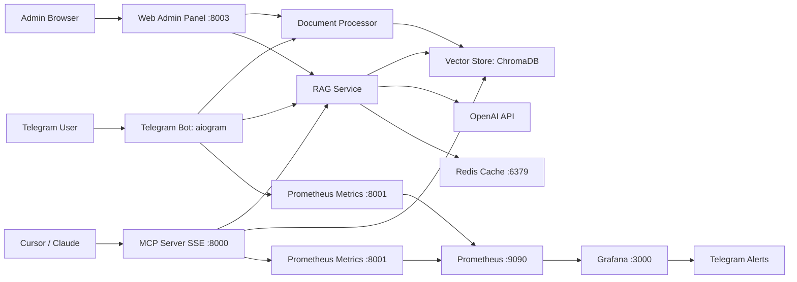

# RAG Telegram Bot

Готовый к production Telegram-бот с RAG-поиском по документам PDF и Markdown (`.md`), MCP SSE-сервером для интеграции с Cursor/Claude, ускорением повторных запросов через Redis, Web Admin Panel и полноценным стеком мониторинга (Prometheus + Grafana + Telegram alerts).

## Быстрый старт

### Требования

- Python `3.12+`
- Docker Engine + Docker Compose v2
- VPS (рекомендуется для круглосуточной работы бота, MCP и мониторинга)

### Запуск в 3 команды

```bash
cp .env.example .env
docker compose up -d --build
docker compose logs -f bot
```

### Порты сервисов

- `8000` - MCP SSE server
- `8001` - метрики бота (`/metrics`)
- `3000` - Grafana
- `9090` - Prometheus
- `6379` - Redis
- `8003` - Web Admin Panel

### Обязательные переменные окружения (`.env`)

- `TELEGRAM_BOT_TOKEN` - токен Telegram-бота из BotFather
- `OPENAI_API_KEY` - API-ключ для embeddings и LLM
- `ADMIN_USER_IDS` - список Telegram user ID администраторов через запятую
- `TELEGRAM_ALERT_CHAT_ID` - Telegram chat ID для алертов Grafana
- `REDIS_URL` - строка подключения к Redis для кэша запросов
- `ADMIN_PASSWORD` - пароль для авторизации в Web Admin Panel

## Возможности

- Telegram RAG-бот с семантическим поиском и ответами с источниками
- MCP SSE-интеграция для Cursor/Claude (`search_docs`, `list_documents`, `get_document_info`)
- Redis-кэш для повторных RAG-запросов (типичное ускорение повторных запросов в 5-10 раз)
- Web Admin Panel для управления документами и кэшем из браузера
- Стек мониторинга на Prometheus + Grafana
- Полностью русифицированные алерты и исправленные запросы/разметка панелей

## Архитектура



### Поток данных

1. Пользователь загружает PDF или Markdown (`.md`) в Telegram.
2. Бот извлекает текст, делит его на чанки, вычисляет embeddings и сохраняет чанки в ChromaDB.
3. Пользователь задаёт вопрос -> RAG извлекает релевантные чанки -> LLM генерирует обоснованный ответ с источниками.
4. MCP-клиент вызывает `search_docs`/`list_documents`/`get_document_info` через SSE.
5. Повторные запросы, когда возможно, отдаются из Redis-кэша.
6. Администратор управляет файлами и кэшем через web panel.
7. Метрики собираются Prometheus и визуализируются в Grafana; алерты отправляются в Telegram.

## Установка

### Локально (venv)

```bash
python3 -m venv .venv
source .venv/bin/activate
pip install -r requirements.txt
cp .env.example .env
python3 -m bot.main
```

### Docker (рекомендуется)

```bash
cp .env.example .env
docker compose up -d --build
docker compose ps
```

### Настройка `.env`

Минимально необходимые значения:

```bash
TELEGRAM_BOT_TOKEN=your-telegram-bot-token
OPENAI_API_KEY=sk-your-key
ADMIN_USER_IDS=123456789
TELEGRAM_ALERT_CHAT_ID=123456789
REDIS_URL=redis://localhost:6379
ADMIN_PASSWORD=your_strong_password_here
```

## Функциональность

### Команды Telegram

- `/start` - приветствие и краткая инструкция
- `/help` - список доступных команд
- `/upload` - загрузка документа PDF или Markdown (`.md`)
- `/list` - список проиндексированных документов
- `/delete <id>` - удаление документа по ID
- `/stats` - статистика документов/чанков пользователя
- `/doctor` - диагностика состояния сервиса (только для админов)

### MCP-интеграция (Cursor / Claude)

MCP server использует SSE-транспорт:

- Внешний VPS: `http://YOUR_VPS_IP:8000/sse`
- Cursor Remote SSH (тот же host): `http://localhost:8000/sse`

Пример конфигурации Cursor:

```json
{
  "mcpServers": {
    "smartass-rag": {
      "url": "http://localhost:8000/sse"
    }
  }
}
```

### Как работает RAG-поиск

1. Вычисляется embedding запроса.
2. ChromaDB выполняет семантический поиск по близости.
3. Top-чанки форматируются вместе с метаданными источников.
4. LLM получает запрос + контекст + короткую историю диалога.
5. Бот возвращает ответ и список источников с оценкой релевантности.

## Мониторинг

### Prometheus

- endpoint метрик бота: `http://localhost:8001/metrics`
- endpoint метрик MCP (host): `http://localhost:8002/metrics`
- интерфейс Prometheus: `http://localhost:9090`

### Grafana

- Адрес: `http://localhost:3000`
- Логин: `admin`
- Пароль: `admin123` (измените для production)

### Telegram-алерты

1. Укажите `TELEGRAM_BOT_TOKEN` и `TELEGRAM_ALERT_CHAT_ID` в `.env`.
2. Запустите/пересоздайте Grafana:

```bash
docker compose up -d --force-recreate grafana
```

3. Проверьте provisioning:

```bash
docker compose logs --tail=100 grafana
```

Примечания:
- Сообщения алертов русифицированы.
- Панели дашборда (`Database Status`, `Disk Usage`) используют исправленные Prometheus-запросы и корректные размеры layout.

## Диагностика и устранение проблем

### Частые проблемы

- **MCP недоступен**: убедитесь, что сервис `mcp` запущен и порт `8000` открыт.
- **RAG не возвращает ответы**: проверьте `OPENAI_API_KEY`, доступность модели и наличие проиндексированных документов.
- **Ошибки алертинга Grafana**: проверьте логи provisioning и переменные окружения для Telegram chat/token.
- **Ошибки прав в контейнерах**: проверьте права на смонтированные директории (`data`, `docs`, `logs`).
- **Проблемы с Redis-кэшем**: убедитесь, что Redis доступен и `REDIS_URL` указан корректно.
- **Проблемы входа в admin panel**: проверьте `ADMIN_PASSWORD` в `.env`.

### Быстрая проверка состояния

- В Telegram (админ): выполните `/doctor`.
- В Docker:

```bash
docker compose ps
docker compose logs -f bot
```

Web Admin Panel:

```bash
open http://localhost:8003
```

Очистка Redis-кэша:

```bash
docker compose exec redis redis-cli FLUSHALL
```

Быстрая проверка метрик:

```bash
curl -s http://localhost:8001/metrics | rg "db_connected|disk_free_percent|bot_uptime_seconds"
```

### Логи

```bash
docker compose logs -f bot
docker compose logs -f mcp
docker compose logs -f grafana
docker compose logs -f prometheus
```

## 🧪 Тестирование

Запуск набора тестов:

```bash
pytest tests/ -v --cov=bot --cov=admin_panel
```

## API-справка

### MCP-инструменты

- `search_docs(query, top_k=3)` - семантический поиск + сгенерированный ответ с источниками
- `list_documents()` - список проиндексированных документов
- `get_document_info(document_id)` - метаданные/детали по документу

### Метрики (endpoints)

- `GET /metrics` на bot (`:8001`)
- `GET /metrics` на MCP (`:8002`, проброшен с контейнерного `:8001`)

## Production-развёртывание

### Деплой через Docker Compose

```bash
cp .env.example .env
docker compose up -d --build
docker compose ps
```

### Автозапуск через Systemd (опционально)

Создайте `/etc/systemd/system/rag-bot-stack.service`:

```ini
[Unit]
Description=RAG Telegram Bot Stack
After=docker.service
Requires=docker.service

[Service]
Type=oneshot
WorkingDirectory=/opt/rag-telegram-bot
ExecStart=/usr/bin/docker compose up -d
ExecStop=/usr/bin/docker compose down
RemainAfterExit=yes

[Install]
WantedBy=multi-user.target
```

Включение:

```bash
sudo systemctl daemon-reload
sudo systemctl enable --now rag-bot-stack
```

### Резервное копирование / восстановление

Что нужно включать в бэкап:

- `data/chroma_db` - векторный индекс
- `data/bot_memory.db` - память чатов
- `docs/` - загруженные файлы

Пример бэкапа:

```bash
tar -czf rag-backup-$(date +%F).tar.gz data docs
```

Восстановление:

```bash
tar -xzf rag-backup-YYYY-MM-DD.tar.gz
docker compose up -d
```

## 🛡️ Web Admin Panel: Руководство администратора

### Первый вход

- **URL:** `http://<IP_СЕРВЕРА>:8003`
- **Логин:** `admin`
- **Пароль:** Значение переменной `ADMIN_PASSWORD` из вашего файла `.env` (по умолчанию в `.env.example` указано `your_strong_password_here`, замените его на свой).

### Безопасная смена пароля

1. Откройте `.env`
2. Измените значение:

```bash
ADMIN_PASSWORD=your_new_strong_password
```

3. Перезапустите только админ-панель:

```bash
docker compose up -d --force-recreate admin-panel
```

### Рекомендации для Production

- Никогда не используйте пароль по умолчанию или слабые значения `ADMIN_PASSWORD`.
- Ограничьте внешний доступ к порту `8003` через firewall (разрешайте только trusted IP).
- Для публичного доступа проксируйте админку через Nginx/Traefik с HTTPS и базовой защитой.
- Проблема прав на `./docs` и `./data` решается безопасным bootstrap-сценарием в контейнере: сначала корректируются владельцы файлов, затем приложение запускается от непривилегированного пользователя `appuser`.
