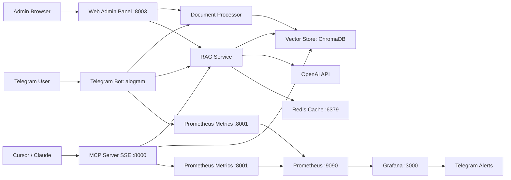

# RAG Telegram Bot

Production-ready Telegram bot with RAG search over PDF/Markdown documents, MCP SSE server for Cursor/Claude integration, Redis cache acceleration, Web Admin Panel, and full monitoring stack (Prometheus + Grafana + Telegram alerts).

## Quick Start

### Requirements

- Python `3.12+`
- Docker Engine + Docker Compose v2
- VPS (recommended for 24/7 bot + MCP + monitoring)

### 3-Command Setup

```bash
cp .env.example .env
docker compose up -d --build
docker compose logs -f bot
```

### Service Ports

- `8000` - MCP SSE server
- `8001` - bot metrics (`/metrics`)
- `3000` - Grafana
- `9090` - Prometheus
- `6379` - Redis
- `8003` - Web Admin Panel

### Required Environment Variables (`.env`)

- `TELEGRAM_BOT_TOKEN` - Telegram bot token from BotFather
- `OPENAI_API_KEY` - API key for embeddings and LLM
- `ADMIN_USER_IDS` - comma-separated Telegram user IDs with admin access
- `TELEGRAM_ALERT_CHAT_ID` - Telegram chat ID for Grafana alerts
- `REDIS_URL` - Redis connection string for query cache
- `ADMIN_PASSWORD` - password for Web Admin Panel auth

## Features

- Telegram RAG bot with semantic search and source-aware answers
- MCP SSE integration for Cursor/Claude (`search_docs`, `list_documents`, `get_document_info`)
- Redis cache for repeated RAG queries (typical repeated-query speedup 5-10x)
- Web Admin Panel for browser-based document and cache management
- Monitoring stack with Prometheus + Grafana
- Russian-localized alerting messages and corrected panel queries/layouts

## Architecture



### Data Flow

1. User uploads PDF/MD in Telegram.
2. Bot extracts text, splits into chunks, computes embeddings, stores chunks in ChromaDB.
3. User asks a question -> RAG retrieves relevant chunks -> LLM generates grounded answer with sources.
4. MCP client calls `search_docs`/`list_documents`/`get_document_info` over SSE.
5. Repeated queries are resolved from Redis cache when possible.
6. Admin can manage files and cache from the web panel.
7. Metrics are scraped by Prometheus and visualized in Grafana; alerts are sent to Telegram.

## Installation

### Local (venv)

```bash
python3 -m venv .venv
source .venv/bin/activate
pip install -r requirements.txt
cp .env.example .env
python3 -m bot.main
```

### Docker (recommended)

```bash
cp .env.example .env
docker compose up -d --build
docker compose ps
```

### `.env` Setup

Minimum required:

```bash
TELEGRAM_BOT_TOKEN=your-telegram-bot-token
OPENAI_API_KEY=sk-your-key
ADMIN_USER_IDS=123456789
TELEGRAM_ALERT_CHAT_ID=123456789
REDIS_URL=redis://localhost:6379
ADMIN_PASSWORD=your_secure_password_here
```

## Functionality

### Telegram Commands

- `/start` - greeting and quick usage info
- `/help` - list of available commands
- `/upload` - upload PDF/Markdown document
- `/list` - list indexed documents
- `/delete <id>` - delete document by ID
- `/stats` - user document/chunk stats
- `/doctor` - health diagnostics (admin only)

### MCP Integration (Cursor / Claude)

MCP server uses SSE transport:

- External VPS: `http://YOUR_VPS_IP:8000/sse`
- Cursor Remote SSH (same host): `http://localhost:8000/sse`

Cursor config example:

```json
{
  "mcpServers": {
    "smartass-rag": {
      "url": "http://localhost:8000/sse"
    }
  }
}
```

### How RAG Search Works

1. Query embedding is computed.
2. ChromaDB performs semantic similarity search.
3. Top chunks are formatted with source metadata.
4. LLM receives query + context + short conversation history.
5. Bot returns answer and source list with relevance score.

## Monitoring

### Prometheus

- Bot metrics endpoint: `http://localhost:8001/metrics`
- MCP metrics endpoint (host): `http://localhost:8002/metrics`
- Prometheus UI: `http://localhost:9090`

### Grafana

- URL: `http://localhost:3000`
- Login: `admin`
- Password: `admin123` (change for production)

### Telegram Alerts

1. Set `TELEGRAM_BOT_TOKEN` and `TELEGRAM_ALERT_CHAT_ID` in `.env`.
2. Start/recreate Grafana:

```bash
docker compose up -d --force-recreate grafana
```

3. Verify provisioning:

```bash
docker compose logs --tail=100 grafana
```

Notes:
- Alert messages are Russian-localized.
- Dashboard panels (`Database Status`, `Disk Usage`) use corrected Prometheus queries and fixed panel layout sizing.

## Troubleshooting

### Common Issues

- **MCP unavailable**: ensure `mcp` service is running and port `8000` is exposed.
- **No answers from RAG**: check `OPENAI_API_KEY`, model availability, and indexed documents.
- **Grafana alerting errors**: inspect provisioning logs and env vars for Telegram chat/token.
- **Permission errors in containers**: verify mounted folder permissions (`data`, `docs`, `logs`).
- **Redis cache issues**: verify Redis is reachable and `REDIS_URL` is correct.
- **Admin panel login issues**: confirm `ADMIN_PASSWORD` in `.env`.

### Quick Health Check

- In Telegram (admin): run `/doctor`.
- In Docker:

```bash
docker compose ps
docker compose logs -f bot
```

Admin panel:

```bash
open http://localhost:8003
```

Redis cache cleanup:

```bash
docker compose exec redis redis-cli FLUSHALL
```

Metrics quick check:

```bash
curl -s http://localhost:8001/metrics | rg "db_connected|disk_free_percent|bot_uptime_seconds"
```

### Logs

```bash
docker compose logs -f bot
docker compose logs -f mcp
docker compose logs -f grafana
docker compose logs -f prometheus
```

## API Reference

### MCP Tools

- `search_docs(query, top_k=3)` - semantic search + generated answer with sources
- `list_documents()` - list indexed documents
- `get_document_info(document_id)` - metadata/details for one document

### Metrics Endpoints

- `GET /metrics` on bot (`:8001`)
- `GET /metrics` on MCP (`:8002` mapped from container `:8001`)

## Production Deployment

### Docker Compose Deployment

```bash
cp .env.example .env
docker compose up -d --build
docker compose ps
```

### Systemd Auto-Start (optional)

Create `/etc/systemd/system/rag-bot-stack.service`:

```ini
[Unit]
Description=RAG Telegram Bot Stack
After=docker.service
Requires=docker.service

[Service]
Type=oneshot
WorkingDirectory=/opt/rag-telegram-bot
ExecStart=/usr/bin/docker compose up -d
ExecStop=/usr/bin/docker compose down
RemainAfterExit=yes

[Install]
WantedBy=multi-user.target
```

Enable:

```bash
sudo systemctl daemon-reload
sudo systemctl enable --now rag-bot-stack
```

### Backup / Restore

Backup important state:

- `data/chroma_db` - vector index
- `data/bot_memory.db` - chat memory
- `docs/` - uploaded files

Example backup:

```bash
tar -czf rag-backup-$(date +%F).tar.gz data docs
```

Restore:

```bash
tar -xzf rag-backup-YYYY-MM-DD.tar.gz
docker compose up -d
```

## 🛡️ Web Admin Panel: Руководство администратора

### Первый вход

1. Откройте URL админки: `http://<your-server>:8003`
2. Используйте логин `admin`
3. Введите пароль из переменной `ADMIN_PASSWORD` (файл `.env`)

### Безопасная смена пароля

1. Откройте `.env`
2. Измените значение:

```bash
ADMIN_PASSWORD=your_new_strong_password
```

3. Перезапустите только админ-панель:

```bash
docker compose up -d --force-recreate admin-panel
```

### Рекомендации для Production

- Никогда не используйте пароль по умолчанию или слабые значения `ADMIN_PASSWORD`.
- Ограничьте внешний доступ к порту `8003` через firewall (разрешайте только trusted IP).
- Для публичного доступа проксируйте админку через Nginx/Traefik с HTTPS и базовой защитой.
- Проблема прав на `./docs` и `./data` решается безопасным bootstrap-сценарием в контейнере: сначала корректируются владельцы файлов, затем приложение запускается от непривилегированного пользователя `appuser`.
